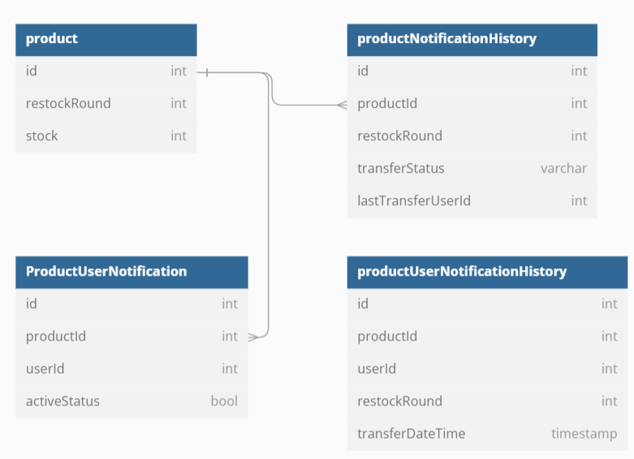

# 재입고 알림 API (기업과제 연습)

---
상품이 재입고 되었을 때 재입고 알림 신청을 한 사용자에게 알림을 전송하는 API

## ERD

---

## 요구 사항

---
- 재입고 알림을 전송하기 전, 상품의 재입고 회차를 1 증가 시킨다.
  * 재고는 0인 상황이고 재입고가 이루어지는 상황을 가정하는 것이기 때문에 요청이 오면 재입고 회차를 증가
- 상품이 재입고 되었을 때, 재입고 알림을 설정한 유저들에게 순서대로 알림 메시지를 전달해야 한다.
  *  
- 회차별 재입고 알림을 받은 유저 목록을 저장해야 한다.
  * 전송이 완료된 유저들은 **유저별 알림 히스토리** 테이블에 저장한다.
- 재입고 알림을 보내던 중 재고가 모두 없어진다면 알림 보내는 것을 중단합니다.
  * 주기적으로 db와 동기화
- 재입고 알림 전송의 상태를 DB 에 저장해야 한다. IN_PROGRESS (발송 중), CANCELED_BY_SOLD_OUT (품절에 의한 발송 중단), CANCELED_BY_ERROR (예외에 의한 발송 중단), COMPLETED (완료)
  * **상품 재입고 알림 히스토리** 테이블에 작업상태를 저장한다.

 

- 알림 메시지는 1초에 최대 500개의 요청을 보낼 수 있다.
    - RateLimiter 를 적용
- Mysql 조회 시, 인덱스를 잘 탈 수 있게 설계해야 합니다. 
- (Optional) 예외에 의해 알림 메시지 발송이 실패한 경우, manual 하게 상품 재입고 알림 메시지를 다시 보내는 API를 호출한다면 마지막으로 전송 성공한 이후 유저부터 다시 알림 메시지를 보낼 수 있어야 한다.
- 시스템 구조 상 비동기로 처리 되어야 하는 부분은 존재하지 않는다고 가정합니다.
